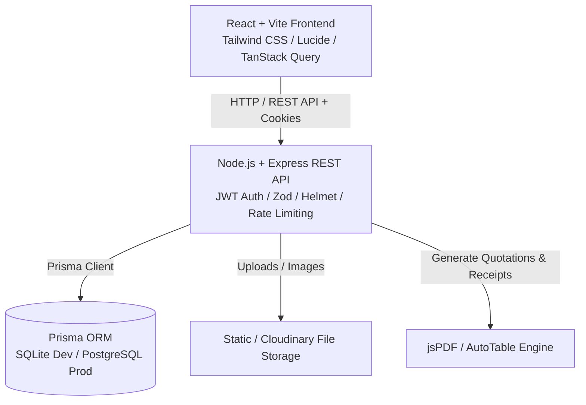

# Architecture & System Design — Sathuragiri Decoration

## 1. Overview
**Sathuragiri Decoration** ("Every Celebration, Beautifully Crafted.") is a full-stack, enterprise-grade event decoration, wedding planning, and services management web application. The platform provides:
1. **A Luxury Public Website**: High-conversion storefront with South Indian wedding aesthetics, interactive service catalogues, portfolio galleries, pricing packages, and a 4-step event booking wizard.
2. **A Secure Admin & Operations Management Platform**: Role-based business ERP covering leads/enquiries pipeline, confirmed bookings, automated quotation builder with server-side tax/discount calculation and PDF generation, payment recording with receipt PDF downloads, crew/vendor dispatching, interactive scheduling calendar, operational expense logging, and analytics with formula-injection-safe CSV exports.

---

## 2. System Architecture

---

## 3. Database Schema Design (Prisma ORM)

The relational schema is normalized with 20 core models:
- **`User`**: Admin (`OWNER`), `MANAGER`, and `STAFF` credentials, bcrypt password hashes, and status.
- **`Customer`**: Client contact dossiers with phone uniqueness, communication preferences, and full event histories.
- **`ServiceCategory` & `Service`**: Multi-tiered service catalogue (Mandapams, Reception, Photography, Catering, Lighting).
- **`Package`**: Editable event packages (Silver, Royal Gold, Imperial Diamond, Custom).
- **`PortfolioProject`**: Visual project showcase with tags, venues, and high-res image sets.
- **`Enquiry` & `EnquiryNote`**: Public lead capture pipeline with follow-up tracking and atomic conversion to bookings.
- **`Booking`, `BookingService`, `BookingAssignment`**: Confirmed event management with date conflict checks, crew rosters, and vendor assignments.
- **`StaffProfile` & `Vendor`**: Internal crew artisans, electricians, and external vendor partners with commercial rates.
- **`Quotation` & `QuotationItem`**: Quotation builder with snapshots of line items, versioning, 18% GST calculation, and PDF export.
- **`Payment`**: Advance, partial, and settlement transactions with balance tracking and PDF receipts.
- **`Expense`**: Raw materials, floral wholesales, labour wages, and logistics expense journal for net profit calculation.
- **`Notification`**: Real-time business activity alerts.
- **`AuditLog`**: Security and financial event trail.
- **`BusinessSettings`**: Dynamic company branding, GST numbers, contact info, and quotation terms.

---

## 4. Security & Business Rules

1. **Monetary Integrity**:
   - Financial totals (subtotals, discounts, taxes, grand totals, and outstanding balances) are recalculated and verified server-side inside atomic database transactions (`prisma.$transaction`).
2. **CSV Formula Injection Prevention**:
   - All exported CSV files sanitize values starting with `=`, `+`, `-`, `@`, `\t`, and `\r` by prepending `'` single quotes.
3. **Authentication & RBAC**:
   - State-changing actions enforce JWT tokens via HttpOnly cookies and Bearer headers.
   - Role permissions:
     - `OWNER`: Full business access, financial settings, deletions, staff & vendor rates.
     - `MANAGER`: Daily operations, enquiry conversions, quotations, and assignments.
     - `STAFF`: Assigned event schedules and roster visibility.
4. **Availability & Conflict Detection**:
   - Backend queries check existing bookings on the target event dates and alert operators of scheduling overlaps.
